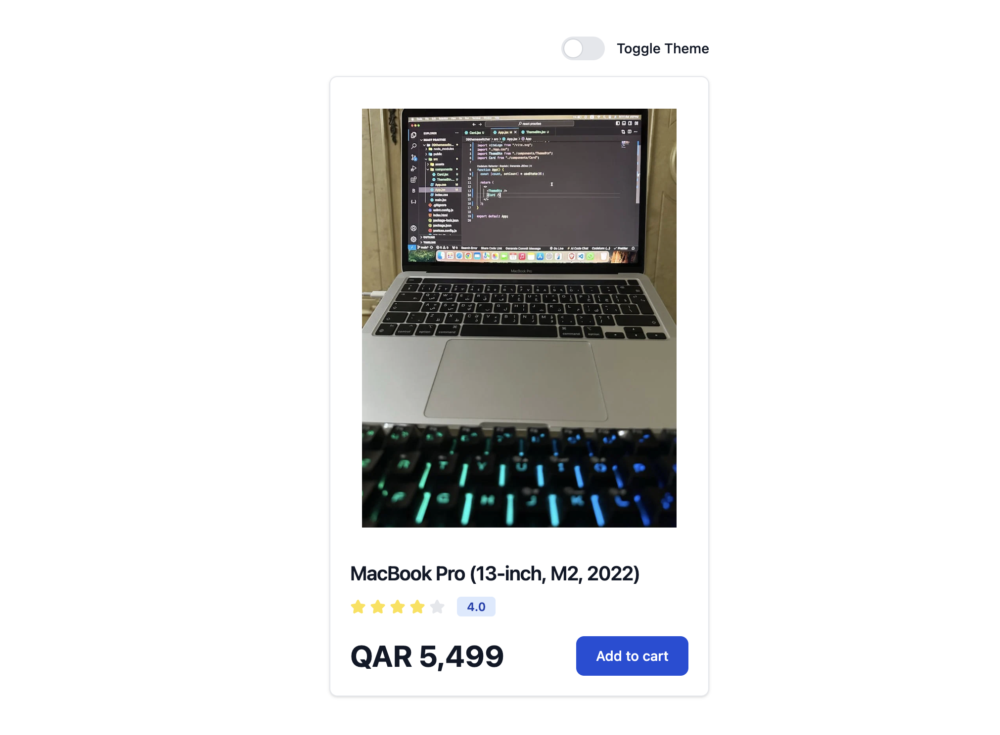
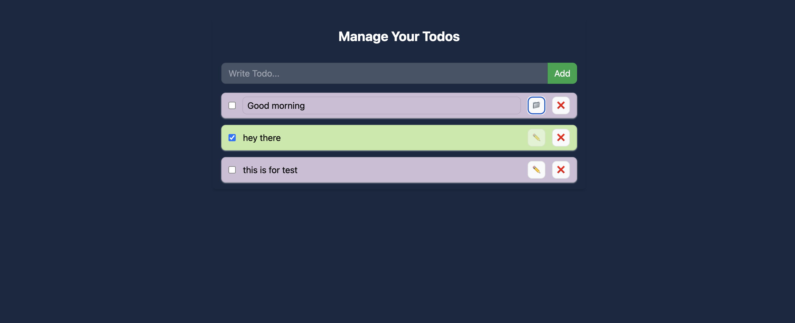

# React Practise Projects

A collection of 10 React projects built with Tailwind CSS.

## Project Showcase

### Project 2: Counter

### Project 3: Props Tailwind

### Project 4: Background changer

### Project 5: Password Generator

### Project 6: Currency Converter

### Project 7: React Router DOM

### Project 8: Context API

### Project 9: Theme Switcher

### Project 10: Todo Context with Local Storage

